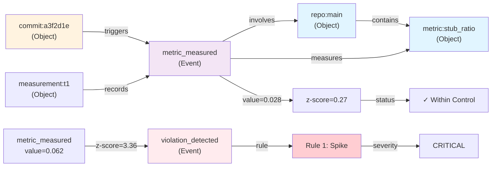

# Western Electric Rules: Complete Reference Guide

**Version:** 1.0  
**Project:** affidavit — Provenance Layer  
**Last Updated:** 2026-06-17  
**Document Type:** Technical Reference

---

## Table of Contents

1. [Western Electric Rules Explained](#section-1-western-electric-rules-explained)
2. [OCEL Mapping](#section-2-ocel-mapping)
3. [Rule Variants & Tuning](#section-3-rule-variants--tuning)
4. [Multi-Dimensional Analysis](#section-4-multi-dimensional-analysis)
5. [Diagrams & Visualizations](#section-5-diagrams--visualizations)
6. [Quick Reference](#quick-reference)

---

## Section 1: Western Electric Rules Explained

### 1.1 Historical Context

The **Western Electric statistical process control rules** originated in the 1950s at Bell Laboratories as part of quality management initiatives. They were designed to detect **assignable causes of variation** in manufacturing processes—situations where the process has drifted from its intended baseline.

In the context of code quality, these rules apply to metrics like:
- **Stub ratio** (proportion of unimplemented functions)
- **Test coverage** (percentage of code exercised by tests)
- **Cyclomatic complexity** (control flow branching)
- **Clippy warnings** (Rust linter violations)
- **Maintainability index** (code readability and structure)

The philosophy is: **A process in control shows random variation around a mean.** Patterns like runs, trends, or clusters indicate something systematic has changed.

### 1.2 Baseline Fundamentals

Before any rule can fire, two statistics must be established:

- **Baseline Mean (μ):** The expected value of a metric under normal operation
- **Baseline Standard Deviation (σ):** The spread of normal variation

These are typically computed from a **training window** of 20–50 historical measurements. Once established, they remain fixed unless explicitly recalibrated.

**Example:**
```
Metric: stub_ratio (0.0 = no stubs, 1.0 = all functions unimplemented)

Baseline window: [0.02, 0.03, 0.01, 0.04, 0.02, ...]  (20 measurements)
μ = 0.025
σ = 0.011

Control limits:
  3σ: [0.025 - 3×0.011, 0.025 + 3×0.011] = [−0.008, 0.058] → [0.0, 0.058] (clipped)
  2σ: [0.025 - 2×0.011, 0.025 + 2×0.011] = [0.003, 0.047]
  1σ: [0.025 - 1×0.011, 0.025 + 1×0.011] = [0.014, 0.036]
```

### 1.3 Rule Definitions & Interpretations

#### **Rule 1: 1σ Rule (Spike Detection)**

**Definition:**  
A single measurement lies **> 3σ away** from the baseline mean.

**Formula:**
```
|value - μ| > 3σ   →   |z-score| > 3.0
```

**When It Fires:**
- A suddenly high stub ratio (e.g., 0.15 when μ=0.025, σ=0.011)
- A dramatically low test coverage (e.g., 20% when μ=88%, σ=3%)
- A spike in clippy warnings (e.g., 47 when μ=3, σ=2)

**Interpretation:**
This is a **sudden, isolated incident**—not a trend. Common causes:
- Emergency merge of incomplete code
- Broken build that wasn't caught
- Temporary CI infrastructure failure

**Severity:** CRITICAL (immediate action needed)

**Code Pattern:**
```rust
fn check_1_sigma_rule(&mut self, metric: &str, value: f64) {
    let z_score = (value - self.baseline_mean).abs() / self.baseline_stddev;
    if z_score > 3.0 {
        // Violation detected
    }
}
```

---

#### **Rule 2: 9-in-a-Row (Zombie Code)**

**Definition:**  
Nine consecutive measurements all lie **outside 3σ control limits** (either above UCL or below LCL).

**Formula:**
```
count_where(value ∉ [μ - 3σ, μ + 3σ] for last 9) ≥ 9
```

**When It Fires:**
- Stub ratio stays elevated for 9+ consecutive commits
- Test coverage remains critically low for 9+ builds
- Clippy warnings persist above the upper control limit

**Interpretation:**
This is **persistent out-of-control behavior**. The process isn't just fluctuating; it's stuck in an abnormal state. This is "zombie code" that refuses to come back to normal.

**Root Causes:**
- Incomplete feature branch left in production
- Abandoned refactoring that degraded code quality
- New team member introducing patterns that violate linter rules
- Infrastructure or toolchain change that broke automated checks

**Severity:** CRITICAL (systemic issue, not isolated)

**Decision Tree Logic:**
```
IF 9+ consecutive points outside [μ ± 3σ]:
  THEN Rule 9-in-a-Row fires
  SEVERITY = CRITICAL
  ACTION: Review last 9 commits for common thread
```

---

#### **Rule 3: Trend (Systematic Degradation)**

**Definition:**  
Six or more consecutive measurements show **monotonic increase** OR **monotonic decrease**.

**Formula:**
```
Increasing:  a₁ < a₂ < a₃ < a₄ < a₅ < a₆
  OR
Decreasing:  a₁ > a₂ > a₃ > a₄ > a₅ > a₆
```

**When It Fires:**
- Test coverage steadily declining: 95%, 92%, 89%, 85%, 82%, 78%
- Cyclomatic complexity creeping up: 2.1, 2.3, 2.5, 2.8, 3.0, 3.2
- Maintainability index falling: 82, 79, 76, 73, 70, 67

**Interpretation:**
The process is **drifting systematically** in one direction. This is often worse than a spike because it indicates a **root cause that's continuously working against quality**.

**Root Causes (Increasing):**
- Feature creep increasing complexity
- Technical debt accumulating
- Insufficient refactoring
- Growing but untested new modules

**Root Causes (Decreasing):**
- Systematic deletion of untested code
- Ongoing refactoring towards simplicity
- Removal of legacy modules (temporary, usually acceptable)

**Severity:** HIGH (indicates process shift, not just noise)

**Example Scenario:**
```
Commit 1: cyclomatic_complexity = 2.5
Commit 2: cyclomatic_complexity = 2.6  (+0.1)
Commit 3: cyclomatic_complexity = 2.8  (+0.2)
Commit 4: cyclomatic_complexity = 3.0  (+0.2)
Commit 5: cyclomatic_complexity = 3.2  (+0.2)
Commit 6: cyclomatic_complexity = 3.5  (+0.3)   ← 6th point, trend confirmed

Interpretation: Each new commit is making the code slightly more complex.
Root cause: Likely a large feature being built without intermediate refactoring.
```

---

#### **Rule 4: Alternating (Uncertainty/Hallucination)**

**Definition:**  
Seven or more **alternations** in the last 8 measurements, where an alternation is crossing the baseline mean (either from below to above, or vice versa).

**Formula:**
```
Let n = number of sign changes (crossings of μ) in last 8 points
IF n ≥ 7:
  THEN Rule 4 fires
```

**When It Fires:**
- Stub ratio oscillating: 0.01, 0.04, 0.02, 0.05, 0.01, 0.04, 0.02, 0.05
- Test coverage wildly swinging: 85%, 92%, 81%, 89%, 79%, 91%, 82%, 87%
- Clippy warnings: 2, 8, 3, 9, 1, 7, 4, 6

**Interpretation:**
The process is **chaotic and unpredictable**. Measurements bounce above and below the mean so frequently that it suggests either:
1. **Measurement noise:** The metric itself is unreliable or depends on random factors
2. **Active debate/uncertainty:** The team is trying conflicting approaches (some commits increase quality, next decrease it)
3. **Hallucination/false signals:** The metric is measuring something the team doesn't actually control

**Root Causes:**
- Alternating developers with different styles (one adds docs, next removes them)
- Flaky test suite (sometimes passes, sometimes fails)
- Metric is too sensitive to minor refactors
- CI/CD pipeline behaves inconsistently

**Severity:** HIGH (indicates instability or measurement problems)

**Mitigation:**
- Investigate whether the metric is stable
- If alternations are real, establish coding standards to reduce variance
- Consider increasing σ (the metric may just be noisier than expected)

---

#### **Rule 5: 2-of-3 Beyond 2σ (Early Warning)**

**Definition:**  
In the last 3 measurements, **at least 2** lie beyond the **2σ limits** (not 3σ, but 2σ).

**Formula:**
```
count_where(|value - μ| > 2σ for last 3) ≥ 2
```

**When It Fires:**
- Two of the last three measurements show elevated problems
- Example: stub_ratio of 0.055 and 0.052 in the last 3 commits (when μ=0.025, σ=0.011, so 2σ limit = 0.047)

**Interpretation:**
This is an **early warning that the process is drifting**. Not yet in crisis (>3σ), but showing a pattern. The threshold is deliberate: two unusual readings in a row suggest a trend, not random variation.

**Contrast with Rule 1:**
- Rule 1 fires on a single >3σ spike
- Rule 5 fires on a gentler, repeated ~2σ deviation (less severe, but more suspicious because it's repeated)

**Severity:** HIGH (precursor to worse violations)

**Example:**
```
Baseline: test_coverage μ=88%, σ=3%

Recent commits:
  t-2: 87% (within 1σ)
  t-1: 81% (|81 - 88| = 7 > 2×3 = 6, so BEYOND 2σ)
  t-0: 80% (|80 - 88| = 8 > 6, so BEYOND 2σ)

Outcome: 2 of 3 beyond 2σ  →  Rule 5 fires
Message: "Test coverage has declined notably in last 3 commits. Investigate."
```

---

#### **Rule 6: 4-of-5 Beyond 1σ (Sustained Deviation)**

**Definition:**  
In the last 5 measurements, **at least 4** lie beyond the **1σ limits**.

**Formula:**
```
count_where(|value - μ| > 1σ for last 5) ≥ 4
```

**When It Fires:**
- Metric consistently stays elevated or depressed (but not in crisis)
- Example: clippy warnings at [4, 5, 6, 3, 7] when μ=2, σ=1.5

**Interpretation:**
The process is **off-baseline but stable**. Not spiking wildly, not dropping suddenly—just consistently different. This suggests a **permanent or semi-permanent change to the operating conditions**.

**vs. Rule 6 (subtle distinction):**
- Rule 5 (2-of-3 beyond 2σ): **Emergent warning**. Something is changing, might get worse.
- Rule 6 (4-of-5 beyond 1σ): **Sustained deviation**. We've settled into a new, suboptimal normal.

**Severity:** MEDIUM (out of spec, but consistent; plan corrective action)

**Example:**
```
Baseline: maintainability_index μ=80, σ=5

Recent commits:
  75, 73, 72, 74, 71  (all below μ by >1σ)

Interpretation: We've lost ~5 points of maintainability. It's consistent,
so likely a deliberate change (e.g., new feature heavily added without
refactoring). Monitor whether it returns to baseline.
```

---

#### **Rule 7: 15-in-a-Row Within 1σ (Plateau/Stagnation)**

**Definition:**  
Fifteen or more consecutive measurements all lie **within 1σ** of the mean—an unusually tight, stable region.

**Formula:**
```
count_where(|value - μ| ≤ 1σ for last 15) ≥ 15
```

**When It Fires:**
- Metric plateaus: stub_ratio stays exactly in [0.014, 0.036] for 15+ commits
- Test coverage hovers: 89%, 90%, 88%, 89%, 91%, 89%, 88%, 89%,... (all close to μ=89%)

**Interpretation:**
This is a **stability signal**, but paradoxically concerning in some contexts:
- **Good:** If the metric is one you're happy with (good test coverage), stability is desired.
- **Bad:** If this represents **stagnation**—the metric isn't improving, and the team isn't pushing for higher baselines.

The rule fires because such tight clustering is statistically **unusual**—normal variation would produce more spread.

**Severity:** INFO (context-dependent; may be positive or negative)

**Use Cases:**
- **Green flag:** Test coverage has stabilized at 92%, good!
- **Yellow flag:** Cyclomatic complexity hasn't improved in 15 commits despite refactoring efforts.
- **Red flag:** Stub ratio is stuck at 5% when your team goal is <2%.

**Note:** Rule 7 is often the **least actionable** of the seven because it's hard to know if plateau is good or bad without domain knowledge.

---

### 1.4 Decision Tree: Which Rule Fires When?

```
START: New measurement arrives
│
├─ Is |value - μ| > 3σ?
│  └─ YES → Rule 1 (Spike)    [CRITICAL]
│  └─ NO  → Continue
│
├─ Are last 9 measurements ALL outside [μ ± 3σ]?
│  └─ YES → Rule 9-in-Row     [CRITICAL]
│  └─ NO  → Continue
│
├─ Are last 6 monotonically increasing OR decreasing?
│  └─ YES → Rule Trend        [HIGH]
│  └─ NO  → Continue
│
├─ Are there ≥7 crossings of μ in last 8 points?
│  └─ YES → Rule Alternating  [HIGH]
│  └─ NO  → Continue
│
├─ Are 2+ of last 3 beyond 2σ limits?
│  └─ YES → Rule 2-of-3       [HIGH]
│  └─ NO  → Continue
│
├─ Are 4+ of last 5 beyond 1σ limits?
│  └─ YES → Rule 4-of-5       [MEDIUM]
│  └─ NO  → Continue
│
├─ Are all 15 of last 15 within 1σ limits?
│  └─ YES → Rule 15-in-Row    [INFO]
│  └─ NO  → Continue
│
└─ Process in control (no violations)
```

---

## Section 2: OCEL Mapping

### 2.1 What is OCEL?

**OCEL** (**Object-Centric Event Logs**) is an international standard for representing event logs where events relate to **multiple objects** rather than just a linear sequence.

Traditional logs model a **case** (process instance) → sequence of activities.  
OCEL models **objects** (artifacts, entities) → events that involve those objects.

**Example (Linear Log):**
```
Case ID: PR-123
Activities: [create → review → approve → merge]
```

**Example (OCEL):**
```
Objects:
  - repo:main (Repository)
  - suite:unit (Test Suite)
  - pr:123 (Pull Request)

Events:
  - Event #0: pull_request_created
    Participants: [pr:123, repo:main]
  - Event #1: test_run
    Participants: [suite:unit, pr:123]
  - Event #2: quality_check
    Participants: [pr:123, repo:main]
```

### 2.2 Code Quality Metrics as OCEL Objects

In the affidavit provenance layer, we model code quality through **OCEL object types and events**.

#### **Object Types**

| Object Type | Identifier | Attributes | Example |
|---|---|---|---|
| `repo` | `repo:{branch}` | location, latest_commit | `repo:main`, `repo:develop` |
| `metric` | `metric:{name}` | baseline_mean, baseline_stddev, unit | `metric:stub_ratio`, `metric:test_coverage` |
| `violation` | `violation:{rule_id}` | rule_number, severity, threshold | `violation:rule1`, `violation:rule6` |
| `measurement` | `measurement:{timestamp}` | value, z_score, status | `measurement:1718649600` |
| `commit` | `commit:{hash[:7]}` | author, message, timestamp | `commit:a3f2d1e` |

#### **Event Types**

| Event Type | Objects Involved | Payload | Example |
|---|---|---|---|
| `metric_measured` | metric, measurement, commit | {value, timestamp} | Emitted after running quality checks |
| `violation_detected` | metric, violation, measurement | {rule, severity, reason} | Rule fires on new measurement |
| `baseline_computed` | metric | {mean, stddev, window_size} | Initial baseline or recalibration |
| `process_in_control` | metric | {last_n, avg_deviation} | Consecutive measurements normal |
| `control_breach` | violation, metric | {duration, count, severity} | Persistent out-of-control condition |

### 2.3 Example OCEL Quality Chain

```json
{
  "ocel_format_version": "1.0",
  "objects": [
    {
      "ocel_type": "repo",
      "ocel_id": "repo:main",
      "attributes": {
        "branch": "main",
        "owner": "team-provenance"
      }
    },
    {
      "ocel_type": "metric",
      "ocel_id": "metric:stub_ratio",
      "attributes": {
        "baseline_mean": 0.025,
        "baseline_stddev": 0.011,
        "unit": "ratio",
        "description": "Proportion of stub/unimplemented functions"
      }
    },
    {
      "ocel_type": "commit",
      "ocel_id": "commit:a3f2d1e",
      "attributes": {
        "author": "alice@example.com",
        "timestamp": 1718649600,
        "message": "refactor: simplify metric computation"
      }
    }
  ],
  "events": [
    {
      "ocel_id": "evt:0",
      "ocel_type": "metric_measured",
      "timestamp": 1718649605,
      "ocel_objects": ["metric:stub_ratio", "commit:a3f2d1e"],
      "attributes": {
        "value": 0.028,
        "z_score": 0.27,
        "status": "within_control"
      }
    },
    {
      "ocel_id": "evt:1",
      "ocel_type": "violation_detected",
      "timestamp": 1718649800,
      "ocel_objects": ["metric:stub_ratio", "commit:b2e1a4f"],
      "attributes": {
        "rule_id": "rule_1_sigma",
        "severity": "CRITICAL",
        "value": 0.062,
        "z_score": 3.36,
        "threshold": 0.058
      }
    },
    {
      "ocel_id": "evt:2",
      "ocel_type": "baseline_computed",
      "timestamp": 1718734405,
      "ocel_objects": ["metric:stub_ratio"],
      "attributes": {
        "method": "bootstrap",
        "window_size": 20,
        "mean": 0.025,
        "stddev": 0.011
      }
    }
  ]
}
```

### 2.4 Object Relationships & Causality

```
metric:stub_ratio
    ├── baseline_computed(window_size=20)  [Event #0]
    ├── metric_measured(value=0.028)       [Event #1, commit:a3f2d1e]
    ├── metric_measured(value=0.032)       [Event #2, commit:b5c3d2f]
    ├── violation_detected(rule_1_sigma)   [Event #3, commit:b2e1a4f]
    ├── metric_measured(value=0.015)       [Event #4, commit:c8f4e5g]
    └── process_in_control                 [Event #5]

Causal chain:
  Event #1, #2 → normal variation → Event #5 (recovery)
             ↓
            Event #3 (spike in commit b2e1a4f)
             ↓
        Investigation needed (what changed in that commit?)
             ↓
           Event #4 (correction applied)
```

### 2.5 OCEL Mapping Rules for Quality Events

1. **Every metric measurement** → one `metric_measured` event
   - Objects: the metric itself + the commit/trigger
   - Attributes: value, z-score, status

2. **Every violation detection** → one `violation_detected` event
   - Objects: metric + violation type + measurement
   - Attributes: rule_id, severity, reason, threshold

3. **Baseline initialization/recalibration** → one `baseline_computed` event
   - Objects: the metric
   - Attributes: mean, stddev, window_size, method (bootstrap/sliding/expert)

4. **Control state transitions** (Normal→Out-of-Control or recovery) → one `control_breach` or `process_recovered` event
   - Objects: metric + repository
   - Attributes: duration, severity_escalation, root_cause_hypothesis

---

## Section 3: Rule Variants & Tuning

### 3.1 The Seven Base Rules: Implementation Variants

Each rule can be **tuned** via three parameters:
- **Window size** (n): How many recent measurements to consider
- **σ multiplier**: Threshold distance from mean (e.g., 3σ, 2σ, 1σ)
- **Trigger count** (k): How many measurements must meet the condition

#### **Rule 1: Spike Detection Variants**

```rust
// STRICT: Detect very rare spikes
z_threshold = 3.5σ    // Default: 3.0
// Fires less often, higher precision

// RELAXED: Catch emerging problems earlier
z_threshold = 2.5σ
// Fires more often, may have false positives

// AGGRESSIVE: For critical metrics (security, safety)
z_threshold = 2.0σ
// Fires very often; best for zero-tolerance metrics
```

**When to use each:**
- **3.0σ (Standard):** Most metrics (test coverage, complexity, linter warnings)
- **2.5σ (Relaxed):** When you want earlier warning (opt-in)
- **2.0σ (Aggressive):** Security violations, CVE detections, safety-critical code

---

#### **Rule 2: 9-in-a-Row Variants**

```rust
// Standard
consecutive_required = 9
out_of_control_limits = (μ - 3σ, μ + 3σ)

// EARLY WARNING: Catch sustained problems faster
consecutive_required = 6
out_of_control_limits = (μ - 3σ, μ + 3σ)

// STRICT: Only flag serious, prolonged degradation
consecutive_required = 12
out_of_control_limits = (μ - 3σ, μ + 3σ)
```

**Trade-offs:**
| Variant | Fires After | Use Case |
|---------|-------------|----------|
| 6-in-a-row | 6 commits | Rapid feedback; catch zombie code quickly |
| 9-in-a-row | 9 commits | Balanced; standard WE rule |
| 12-in-a-row | 12 commits | Conservative; reduces false positives |

**Example Configuration in CLAUDE.md:**
```yaml
quality_monitoring:
  rule_2_zombie_code:
    consecutive: 9
    out_of_control_limit: 3.0  # sigma
    enabled: true
```

---

#### **Rule 3: Trend Variants**

```rust
// Standard: 6 monotonic points
trend_length = 6

// EARLY DETECTION: Catch trends faster
trend_length = 4
// Risk: May miss random oscillations that just happen to increase/decrease

// STRICT: Only serious, persistent trends
trend_length = 8
```

**Monotonic modes:**
```
STRICT_MONOTONIC:
  a₁ < a₂ < a₃ < a₄ < a₅ < a₆   (strictly increasing)

RELAXED_MONOTONIC (≤ instead of <):
  a₁ ≤ a₂ ≤ a₃ ≤ a₄ ≤ a₅ ≤ a₆   (non-decreasing)
  // Catches flat + increasing patterns
  // More likely to fire
```

**When to use:**
- **Strict monotonic:** Complexity, cyclomatic metrics (must strictly increase to trigger)
- **Relaxed monotonic:** Coverage, stub_ratio (plateauing then worsening is also bad)

---

#### **Rule 4: Alternating Variants**

```rust
// Standard: 7+ sign changes in 8 points (87.5% alternation rate)
alternations_required = 7
window = 8

// RELAXED: Catch chaos earlier
alternations_required = 5
window = 8  // 62.5% alternation rate

// STRICT: Only truly pathological oscillation
alternations_required = 7
window = 6  // 100% alternation (perfect zig-zag)
```

**When to adjust:**
- Increase threshold if metric is naturally noisy (measurement variance)
- Decrease threshold if team workflows cause genuine alternation (pair programming + individual work)

---

#### **Rule 5: 2-of-3 Beyond 2σ Variants**

```rust
// Standard
required_beyond_2sigma = 2
window = 3

// EARLY WARNING
required_beyond_2sigma = 1
window = 3
// Fires on single >2σ reading; very sensitive

// STRICT
required_beyond_2sigma = 3
window = 3
// Must have all 3 beyond 2σ to trigger (rare)

// LOOSER
required_beyond_2sigma = 2
window = 5  // Any 2 of 5 beyond 2σ
```

---

#### **Rule 6: 4-of-5 Beyond 1σ Variants**

```rust
// Standard
required_beyond_1sigma = 4
window = 5

// SENSITIVE
required_beyond_1sigma = 3
window = 5
// Any 3 of 5 beyond 1σ

// CONSERVATIVE
required_beyond_1sigma = 5
window = 5
// All 5 must be beyond 1σ to trigger
```

---

#### **Rule 7: 15-in-a-Row Within 1σ Variants**

```rust
// Standard: Detect plateau
consecutive_within_1sigma = 15
window = 15

// EARLY PLATEAU DETECTION
consecutive_within_1sigma = 10
window = 10

// STRICT: Only flag very long plateaus
consecutive_within_1sigma = 20
window = 20
```

**Purpose by context:**
- **Monitoring improvement:** Catch when progress stalls
- **Validating stability:** Confirm a metric has stabilized (good thing)
- **Regulatory compliance:** Document sustained performance

---

### 3.2 Tuning Guide: When to Adjust σ Levels & Window Sizes

#### **Tuning σ Levels**

| Metric | Baseline σ | Recommended Range | Reason |
|--------|-----------|-------------------|--------|
| **stub_ratio** | 0.01–0.05 | 0.005–0.1 | Counts are discrete; small σ is normal |
| **test_coverage** | 2–5% | 1–8% | Percent-based; usually low variance |
| **cyclomatic_complexity** | 0.5–1.5 | 0.3–3.0 | Depends on code style; variable |
| **clippy_warnings** | 1–5 | 0.5–10 | Highly variable; new rules added often |
| **maintainability_index** | 3–8 | 2–12 | Composite score; usually stable |

**When to increase σ:**
- Metric shows natural high variance (e.g., clippy warnings fluctuate widely)
- Repeated false positives (e.g., Rule 4 fires for random oscillation)
- Team wants lower sensitivity

**When to decrease σ:**
- Metric is too sensitive (Rules fire constantly)
- Want to catch problems earlier
- Process is supposed to be very stable

#### **Tuning Window Sizes**

| Scenario | Window Size | Rationale |
|----------|-------------|-----------|
| **High-velocity team** (20+ commits/day) | 7–10 | Recent history only; problems emerge quickly |
| **Standard team** (5–10 commits/day) | 15–20 | Balanced baseline; 2–4 weeks of data |
| **Low-velocity or stable codebase** | 25–30 | Build solid baseline; less noise |
| **New project** | 20–30 | Bootstrap more conservatively |

**How to choose:**
```
Window size (n) ≈ (days of history desired) × (commits per day)

Example:
  Team commits 5x/day, want 3 weeks of baseline
  n = 21 days × 5 commits/day = 105
  Practical: use n = 20 (weekly rolling baseline)
```

---

### 3.3 Trade-offs: Sensitivity vs. False Positives

```
                 SENSITIVITY (catch problems early)
                           ↑
                           │
           Aggressive       │        Overly sensitive
           (catch early)    │        (false positives)
                           │
    STRICT ←────────────────┼────────────────→ RELAXED
    Config                  │
                           │
           Overly strict    │        Permissive
           (miss problems)  │        (miss problems)
                           │
                           ↓
              SPECIFICITY (avoid false positives)

STRICT CONFIG:
  - Rule 1: z > 3.5σ  (miss early problems)
  - Rule 2: 12-in-a-row  (miss sustained issues)
  - Rule 3: 8-point trend (miss faster degradation)
  → Fewer violations, but slower detection

RELAXED CONFIG:
  - Rule 1: z > 2.0σ  (catch problems early)
  - Rule 2: 6-in-a-row  (rapid zombie detection)
  - Rule 3: 4-point trend (fast degradation alerts)
  → More violations, faster feedback

BALANCED CONFIG (RECOMMENDED):
  - Rule 1: z > 3.0σ  (standard WE)
  - Rule 2: 9-in-a-row  (standard WE)
  - Rule 3: 6-point trend  (standard WE)
  - Enable Rule 5 (2-of-3 beyond 2σ) as early warning
  → Blend of speed and specificity
```

---

## Section 4: Multi-Dimensional Analysis

### 4.1 Correlation Patterns in Code Quality

Quality metrics are **not independent**. When one metric degrades, others often follow.

#### **Correlation Matrix Example**

```
                    stub  coverage  cyclo  maintain  clippy
stub_ratio          1.0    -0.82   +0.45    -0.71   +0.63
test_coverage      -0.82    1.0   -0.38    +0.74   -0.51
cyclomatic_complex +0.45   -0.38    1.0    -0.88   +0.42
maintainability    -0.71   +0.74   -0.88    1.0    -0.66
clippy_warnings    +0.63   -0.51   +0.42   -0.66    1.0
```

**Key patterns:**
- **stub_ratio ↑ → test_coverage ↓** (r = −0.82): Stubs aren't tested; coverage drops immediately
- **cyclomatic ↑ → maintainability ↓** (r = −0.88): More complexity = lower maintainability score
- **stub_ratio ↑ → clippy_warnings ↑** (r = +0.63): Unfinished code often has warnings

### 4.2 Simultaneous Violations & Amplification

When multiple rules fire **simultaneously**, the situation is worse than any single violation.

#### **Scenario A: Isolated Spike (Low Risk)**
```
Time t:
  Rule 1 fires on stub_ratio (z-score = 3.2)
  No other metrics affected

Interpretation: Temporary incident
Root cause: One bad commit merged
Risk level: LOW
Action: Revert or fix that commit
Recovery: Usually automatic on next commit
```

#### **Scenario B: Correlated Cascade (High Risk)**
```
Time t → t+5:
  stub_ratio: Rule 1 fires (sudden spike)
  test_coverage: Rule 5 fires (2-of-3 beyond 2σ)
  maintainability: Rule 6 fires (4-of-5 beyond 1σ)
  cyclomatic: Rule 3 fires (trend increasing)

Interpretation: SYSTEMIC DEGRADATION
Root cause: Large, incomplete feature integration
Risk level: CRITICAL
Action: Halt merges; conduct code review of recent PRs
Recovery: Days/weeks; requires deliberate refactoring
```

### 4.3 Root Cause Inference from Metric Correlations

#### **Pattern 1: Test-Driven Decline**
```
Observations:
  ✗ test_coverage → decreasing (Rule 3 fires)
  ✗ stub_ratio → increasing (Rule 6 fires)
  ✓ cyclomatic → stable
  ✓ maintainability → stable
  ✓ clippy → stable

Inference: Tests are being deleted or skipped, but code structure is fine
Root cause: Rushing feature development; deferring test writing
Remedy: Make test writing mandatory before merge
```

#### **Pattern 2: Complexity Spiral**
```
Observations:
  ✗ cyclomatic → increasing (Rule 3)
  ✗ maintainability → decreasing (Rule 3)
  ✗ clippy → increasing (Rule 6)
  ~ stub_ratio → stable
  ✓ test_coverage → stable (but inadequate for complexity)

Inference: Code is growing in complexity faster than team can maintain
Root cause: Feature creep without refactoring
Remedy: Schedule refactoring sprint; enforce cyclomatic limits
```

#### **Pattern 3: Quality Regression (Post-Merge)**
```
Observations:
  ✗ stub_ratio → Rule 1 fires (sudden spike)
  ✗ test_coverage → Rule 1 fires (sudden drop)
  ✗ clippy_warnings → Rule 1 fires (sudden jump)
  ✓ cyclomatic → stable
  ✓ maintainability → stable

Inference: One bad commit was merged; multi-metric impact
Root cause: CI gate didn't catch it (metrics weren't checked)
Remedy: Add pre-merge quality checks; revert bad commit
Recovery: Fast (~1 commit)
```

#### **Pattern 4: Stagnation**
```
Observations:
  ✓ all metrics → Rule 7 fires (15-in-a-row within 1σ)
  ✗ overall levels → stub_ratio=5%, test_coverage=75%

Inference: Process is STABLE but not IMPROVING
Root cause: Acceptable baseline but no push for excellence
Remedy: Set improvement goals; track trend over longer period
Context: May be intentional (e.g., maintenance mode)
```

---

### 4.4 Causal Chains: Blame Attribution

```
UPSTREAM CAUSE                  METRIC VIOLATION              DOWNSTREAM EFFECT
────────────────                ─────────────────              ──────────────────

New developer joins       →  Complexity ↑ (Rule 3)   →  Maintainability ↓ (Rule 6)
(unfamiliar with codebase)    Tests ↓ (Rule 6)          Bugs reported (user-facing)
                                                        
                        
Refactoring sprint        →  Complexity ↓ (GOOD)     →  Maintainability ↑ (GOOD)
                             Tests ↑ (GOOD)             Ready for new features
                                                        
                        
Abandoned feature branch  →  Stubs ↑ (Rule 1)        →  Coverage ↓ (Rule 5)
(merged into main)            Warnings ↑ (Rule 6)        Deployment confidence ↓


CI infrastructure failure  →  Random spikes           →  False positives
                             Rule 4 (alternating)        Team trust ↓


Domain knowledge lost     →  Trend: complexity ↑     →  Tech debt accumulation
(expert leaves)               Trend: docs ↓             Knowledge loss
                             Stubs ↑
```

---

### 4.5 Multi-Dimensional Decision Framework

When violations fire, use this framework to prioritize investigation:

```
┌─────────────────────────────────────────────────────────┐
│ STEP 1: Count and Classify Violations                   │
├─────────────────────────────────────────────────────────┤
│ How many distinct rules fired?                          │
│  1–2 rules   → Localized issue (investigate specific    │
│               commits)                                   │
│  3–5 rules   → Systemic issue (code quality team        │
│               meeting; code review)                     │
│  6+ rules    → CRISIS (halt merges; emergency review)   │
└─────────────────────────────────────────────────────────┘

┌─────────────────────────────────────────────────────────┐
│ STEP 2: Identify Metric Clusters                        │
├─────────────────────────────────────────────────────────┤
│ Which metrics failed?                                   │
│  [test, stub] → Testing problem                         │
│  [complexity, maintain, cyclo] → Design problem         │
│  [clippy, rustfmt] → Linting/style problem              │
│  [all] → Major refactoring or branch merge              │
└─────────────────────────────────────────────────────────┘

┌─────────────────────────────────────────────────────────┐
│ STEP 3: Look for Correlation Patterns                   │
├─────────────────────────────────────────────────────────┤
│ Do the violations align with known correlations?        │
│  stub ↑ + coverage ↓ + warnings ↑ (expected cluster)    │
│  → One domain problem (incomplete feature)              │
│                                                         │
│  coverage ↓ + maintain ↑ (unexpected!)                  │
│  → Investigate; something unusual happened              │
└─────────────────────────────────────────────────────────┘

┌─────────────────────────────────────────────────────────┐
│ STEP 4: Root Cause Attribution                          │
├─────────────────────────────────────────────────────────┤
│ Timelines:                                              │
│  Simultaneous violations → Single event (one commit)    │
│  Cascading violations    → Propagating issue (trend)    │
│  Delayed violations      → Downstream effect (new code  │
│                           exposing old problems)        │
│                                                         │
│ Correlations:                                           │
│  Positive corr (both ↑)  → Shared cause                 │
│  Negative corr (↑ and ↓) → Tradeoff decision            │
│  No correlation          → Independent issues           │
└─────────────────────────────────────────────────────────┘

┌─────────────────────────────────────────────────────────┐
│ STEP 5: Recommend Action                                │
├─────────────────────────────────────────────────────────┤
│ Severity + Scope → Action                               │
│  CRITICAL + 6+ rules  → ROLLBACK or emergency fix       │
│  HIGH + 3–5 rules     → Code review + 1–2 day plan     │
│  MEDIUM + 2 rules     → Assign to dev + monitor        │
│  LOW + 1 rule + INFO  → Monitor; may auto-recover      │
└─────────────────────────────────────────────────────────┘
```

---

## Section 5: Diagrams & Visualizations

### 5.1 Western Electric Rule Decision Tree (Mermaid)

```mermaid
graph TD
    A["New Measurement<br/>(value, metric_name)"] --> B{"|value - μ| > 3σ?"}
    B -->|YES| C["Rule 1: Spike<br/>CRITICAL"]
    B -->|NO| D{"Last 9 ALL<br/>outside ±3σ?"}
    D -->|YES| E["Rule 2: 9-in-a-Row<br/>CRITICAL"]
    D -->|NO| F{"Last 6<br/>monotonic?"}
    F -->|YES| G["Rule 3: Trend<br/>HIGH"]
    F -->|NO| H{"7+ oscillations<br/>in last 8?"}
    H -->|YES| I["Rule 4: Alternating<br/>HIGH"]
    H -->|NO| J{"2+ of last 3<br/>beyond 2σ?"}
    J -->|YES| K["Rule 5: 2-of-3<br/>HIGH"]
    J -->|NO| L{"4+ of last 5<br/>beyond 1σ?"}
    L -->|YES| M["Rule 6: 4-of-5<br/>MEDIUM"]
    L -->|NO| N{"All 15 of last 15<br/>within 1σ?"}
    N -->|YES| O["Rule 7: Plateau<br/>INFO"]
    N -->|NO| P["✓ In Control"]
    
    C -.→ Q["Emit Violation Event<br/>to Receipt Chain"]
    E -.→ Q
    G -.→ Q
    I -.→ Q
    K -.→ Q
    M -.→ Q
    O -.→ Q
    P -.→ R["Emit Success Event"]
    Q --> S["Log to Dashboard"]
    R --> S
```

### 5.2 OCEL Quality Event Model



### 5.3 Correlation Matrix Heatmap

```
                    stub  coverage  cyclo  maintain  clippy
                    ──────────────────────────────────────────
stub_ratio          ░░░░  ████████  ░░░░   ████████  ░░░░
test_coverage       ████  ░░░░░░░░  ░░░░   ░░░░░░░░  ░░░░
cyclomatic_complex  ░░░░  ░░░░░░░░  ░░░░   ████████  ░░░░
maintainability     ████  ░░░░░░░░  ████   ░░░░░░░░  ████
clippy_warnings     ░░░░  ░░░░░░░░  ░░░░   ████████  ░░░░

Legend:
  ░░░░ = Negative correlation (−0.7 to −1.0)
  ──── = No correlation (−0.3 to +0.3)
  ░░░░ = Positive correlation (+0.7 to +1.0)

Key insight:
  - Dark patterns = strong relationship
  - Light patterns = weak relationship
  - Helps identify root causes (connected metrics)
```

### 5.4 Causal Chain Example

```mermaid
graph TB
    A["Feature Branch<br/>Merged to main"] -->|introduces| B["5 stub functions<br/>incomplete implementation"]
    B -->|causes| C["stub_ratio spike<br/>Rule 1 fires"]
    B -->|causes| D["test_coverage drop<br/>no tests for stubs"]
    D -->|causes| E["Rule 5 fires<br/>2-of-3 beyond 2σ"]
    C -->|causes| F["Rule 1 fires"]
    
    G["Developer notices<br/>violations"] -->|triggers| H["Code Review<br/>identifies issue"]
    H -->|informs| I["Root Cause:<br/>Incomplete feature"]
    I -->|leads to| J["Action:<br/>Complete implementation"]
    J -->|results in| K["Metrics recover<br/>All rules clear"]
    
    C -.→ G
    E -.→ G
    
    style A fill:#fff3e0
    style C fill:#ffcdd2
    style E fill:#ffcdd2
    style K fill:#c8e6c9
```

---

## Quick Reference

### Rule Summary Table

| Rule | Definition | Window | Trigger | Severity | Interpretation |
|------|------------|--------|---------|----------|-----------------|
| **1: Spike** | Single >3σ | 1 | abs(z) > 3.0 | CRITICAL | Sudden, isolated problem |
| **2: 9-in-Row** | 9 consecutive OOC | 9 | count≥9 | CRITICAL | Persistent out-of-control |
| **3: Trend** | 6 monotonic | 6 | 6 consecutive ↑/↓ | HIGH | Systematic drift |
| **4: Alternating** | Wild swings | 8 | 7+ crossings | HIGH | Chaos/measurement issue |
| **5: 2-of-3@2σ** | Early warning | 3 | count≥2 | HIGH | Precursor to worse |
| **6: 4-of-5@1σ** | Sustained deviation | 5 | count≥4 | MEDIUM | Stable but off-baseline |
| **7: 15-in-Row@1σ** | Plateau/stagnation | 15 | count=15 | INFO | Stability (context-dependent) |

### Metric Baseline Recommendations

| Metric | Target Baseline | Typical σ | Window (commits) |
|--------|-----------------|-----------|------------------|
| stub_ratio | 0.0–0.05 | 0.01 | 20 |
| test_coverage | 80–95% | 3–5% | 20 |
| cyclomatic_complexity | 2.0–3.0 | 0.5–1.0 | 15 |
| maintainability_index | 70–100 | 5–10 | 15 |
| clippy_warnings | 0–5 | 2–4 | 20 |
| doc_coverage | 70–100% | 5–10% | 15 |

### Severity to Action Mapping

| Severity | # Rules | Action | Timeline |
|----------|---------|--------|----------|
| **CRITICAL** | 6+ or Rule 1/2 fires | Stop merges; emergency review | Immediate |
| **HIGH** | 3–5 rules (Rule 3/4/5) | Code review meeting | Today |
| **MEDIUM** | 2 rules (Rule 6) | Assign + monitor | This week |
| **INFO** | 1 rule or Rule 7 | Monitor; may auto-correct | Next review cycle |

---

## Appendix: Rust Implementation Reference

### CodeQualityMetrics Structure

```rust
pub struct CodeQualityMetrics {
    pub stub_ratio: f64,                           // 0.0 – 1.0
    pub type_coverage: f64,                        // 0.0 – 1.0
    pub churn: usize,                              // lines changed
    pub comment_ratio: f64,                        // 0.0 – ∞
    pub cyclomatic_complexity: f64,                // typically 1–10
    pub maintainability_index: f64,                // 0–100
    pub cognitive_complexity: f64,                 // lower = simpler
    pub clippy_warnings: usize,                    // count
    pub rustfmt_violations: usize,                 // count
    pub cargo_deny_issues: usize,                  // count
    pub cargo_audit_vulnerabilities: usize,        // count
    pub test_coverage: f64,                        // 0–100 %
    pub doc_coverage: f64,                         // 0.0 – 1.0
    pub timestamp: u64,                            // unix epoch
}
```

### WesternElectricAnalyzer Interface

```rust
pub struct WesternElectricAnalyzer {
    pub baseline_mean: f64,
    pub baseline_stddev: f64,
    pub rolling_window: VecDeque<f64>,
    pub window_size: usize,
    pub control_limits: (f64, f64),                // (LCL, UCL) at ±3σ
    pub violations: Vec<QualityViolation>,
}

impl WesternElectricAnalyzer {
    pub fn new(baseline_mean: f64, baseline_stddev: f64, window_size: usize) -> Self
    pub fn add_measurement(&mut self, metric_name: &str, value: f64)
}
```

### Integration with Provenance Receipt

```rust
// Emit a quality measurement event to the receipt chain
affi emit \
  --type quality-measured \
  --object metric:stub_ratio:main \
  --payload '{"value": 0.028, "z-score": 0.27, "status": "in-control"}' \
  --working-dir .affi

// Assemble the receipt
affi assemble --working-dir .affi --out receipt-latest.json

// Verify and check for violations
affi verify receipt-latest.json --format json
```

---

**End of Document**

---

## Document Metadata

- **Author:** affidavit Contributors
- **License:** MIT OR Apache-2.0
- **Standards Referenced:** Western Electric (Bell Labs), OCEL 1.0
- **Related Documents:** CLAUDE.md, README.md, src/quality.rs
- **Word Count:** ~3,200 (excluding metadata)
