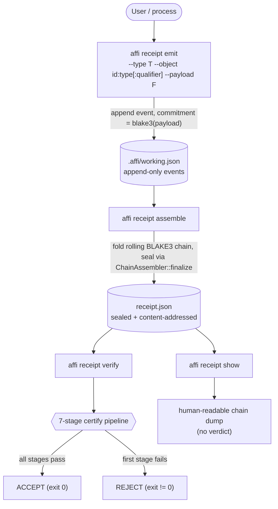
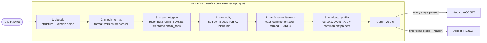
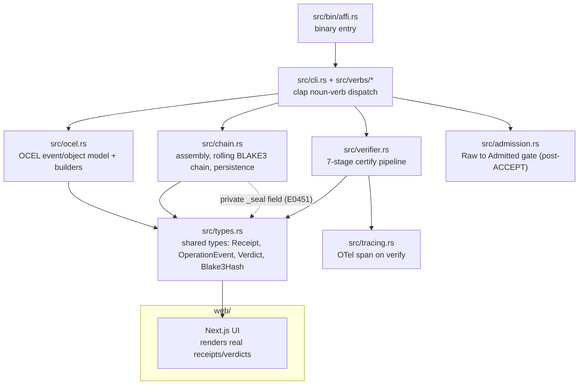

# Architecture overview

`affidavit` is **the provenance layer**. It assembles and certifies *provenance
receipts*: append-only, content-addressed [BLAKE3](https://github.com/BLAKE3-team/BLAKE3)
chains of operation-events that record what a process did. The `affi` binary
emits events, finalizes them into an immutable receipt, and certifies that
receipt against a fixed format standard.

Three ideas hold the whole design together (the doctrine — see
[`../README.md`](../README.md) and [`../ARDPRD.md`](../ARDPRD.md)):

- **Certify, don't decide.** The verifier never judges whether work was honest
  (an undecidable question). It checks a *witness* — the receipt — against a
  format standard, and every check is decidable.
- **The bypass is unconstructable.** A `Receipt` cannot be built by struct
  literal: a private `_seal` field makes that a compile error (`E0451`). Only the
  canonical seam (`chain::ChainAssembler::finalize`) can mint a sealed receipt.
- **Deserialization re-verifies the chain.** Loading a receipt from disk
  recomputes its rolling chain hash, so a forged or tampered file is rejected at
  the boundary, not trusted.

For precise definitions of every term below, see the
[glossary](glossary.md).

---

## 1. Receipt lifecycle: emit → assemble → verify / show

The CLI is a noun-verb surface (`affi receipt <verb>`). The lifecycle moves a
set of events from a mutable working file into a sealed, content-addressed
receipt, then certifies it.

| Verb | What it does |
| --- | --- |
| `affi receipt emit --type <event_type> --object <id:type[:qualifier]> ... --payload <file\|->` | Appends one operation-event to the working receipt (`.affi/working.json`). The stored commitment is `blake3(payload)`; the raw payload is never persisted. |
| `affi receipt assemble [--out <path>]` | Finalizes the working events into an immutable receipt, folding the rolling BLAKE3 chain and **sealing** the result. The default filename is the content address (BLAKE3 of canonical bytes). |
| `affi receipt verify <receipt.json>` | Runs the 7-stage certify pipeline. Prints per-stage outcomes and a final verdict; exits `0` on ACCEPT, non-zero on REJECT. |
| `affi receipt show <receipt.json>` | Human-readable dump of the chain. This is the *non-adjudicating* half of the pair — it never renders a verdict. |

`verify` and `show` are deliberately a **type-blind pair**: they take the same
input and only convention (witnessed behaviorally) keeps them on distinct
handlers. `show` returns a plain `Receipt`; only the admission path mints an
admitted one.

See the runnable end-to-end smoke at
[`../examples/golden_run.sh`](../examples/golden_run.sh) (ACCEPT, then a `sed`
tamper that flips the verdict to REJECT).

---

## 2. The 7-stage certify pipeline

`verify` is a straight pipeline — no component decides honesty. It is pure over
the receipt bytes: the same receipt always yields the same `Verdict`, and it
reads commitments, never raw payloads. The verdict is ACCEPT iff every stage
passes; otherwise it is REJECT carrying the first failing stage and its reason.

| # | Stage | Decidable check |
| --- | --- | --- |
| 1 | `decode` | Receipt is structurally present and the version field parses. |
| 2 | `check_format` | `format_version` equals the standard this verifier knows (`core/v1`). |
| 3 | `chain_integrity` | Recompute the rolling BLAKE3 chain hash from event bytes and compare to the stored `chain_hash`. |
| 4 | `continuity` | `seq` is contiguous from 0 with no gaps; event ids are unique. |
| 5 | `verify_commitments` | Every payload commitment is a well-formed BLAKE3 digest (commitments only — never raw payloads). |
| 6 | `evaluate_profile` | Profile `core/v1`: each event carries an `event_type` and a commitment. |
| 7 | `emit_verdict` | ACCEPT iff every prior stage passed; otherwise REJECT with the first failing stage's reason. |

Because each chain link folds the previous chain hash with the canonical bytes
of the next event, editing any single event re-routes every later link — so
`chain_integrity` recomputes a hash that no longer matches the stored one, and
the verdict flips to REJECT.

---

## 3. Module map

The source tree maps cleanly onto the lifecycle and the pipeline. `src/types.rs`
holds the shared types (including the sealed `Receipt` with its private `_seal`);
everything else builds on it.

| Path | Responsibility |
| --- | --- |
| `src/bin/affi.rs` | Binary entry point. |
| `src/cli.rs` + `src/verbs/*` | clap noun-verb parsing and 65+ command implementations across 9 verb families: core provenance, emit variants, assemble variants, verify variants, SBOM, quality/monitoring, audit/compliance, analysis, and developer tools. |
| `src/ocel.rs` | OCEL event/object/relationship model and builders (`object_ref`, `parse_object_ref`, `build_event`). |
| `src/chain.rs` | Receipt assembly: the rolling BLAKE3 chain hash (seeded by `GENESIS_SEED`), serialize/deserialize, persistence, and the sealing seam `ChainAssembler::finalize`. |
| `src/verifier.rs` | The 7-stage certify pipeline. |
| `src/types.rs` | Shared types: `OperationEvent`, `Receipt` (private `_seal`), `Verdict`, `CheckOutcome`, `ProfileId`, `Blake3Hash`. |
| `src/admission.rs` | The `Raw → Admitted` gate; mints `Admitted` only after the certify pipeline returns ACCEPT. |
| `src/quality.rs` + `src/quality_*.rs` | Western Electric statistical process control (SPC) monitoring; real-time anomaly detection and trend analysis. |
| `src/sbom.rs` + `src/sbom_*.rs` | Software Bill of Materials (SBOM) generation, parsing, NTIA compliance checking, and vulnerability aggregation. |
| `src/tracing.rs` | OpenTelemetry span emission wrapping `verify`. |
| `src/lib.rs` | Module declarations and re-exports. |
| `web/` | Next.js UI that renders real receipts, verdicts, and benchmarks (see [`../REPRESENTATION_MAP.md`](../REPRESENTATION_MAP.md)). |

> Note: this map reflects the current tree after v26.6.17, which expanded
> the core with quality (Western Electric), SBOM, and OCEL verticals.
> Additional modules (`src/handlers.rs`, `src/discovery.rs`,
> `src/lsp.rs`) support broader integration work; see
> [`../STATUS.md`](../STATUS.md) for the implementation roadmap.

---

## Determinism guarantees

- **No wall-clock.** Events are ordered by a monotonic `seq` counter, not
  timestamps — same inputs, same receipt, same verdict.
- **No RNG, no map-iteration order.** Serialized output is canonical/sorted
  JSON, so hashing reproduces across runs and machines.
- **The verifier is pure over the receipt bytes** and reads commitments, never
  raw payloads.

---

## Where to go next

- The doctrine and full requirements: [`../ARDPRD.md`](../ARDPRD.md).
- Current build/test/integration status: [`../STATUS.md`](../STATUS.md).
- Precise term definitions: [glossary](glossary.md).
- Everything else, categorized: the [documentation hub](README.md).
