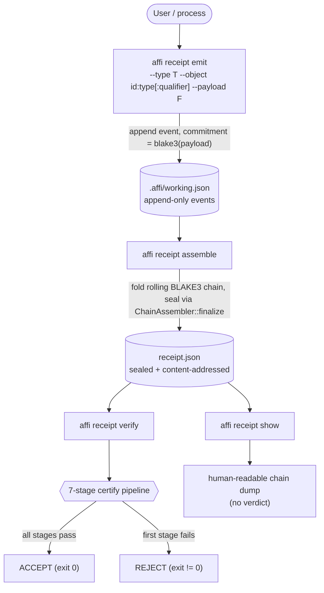
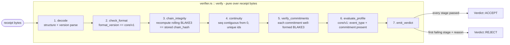
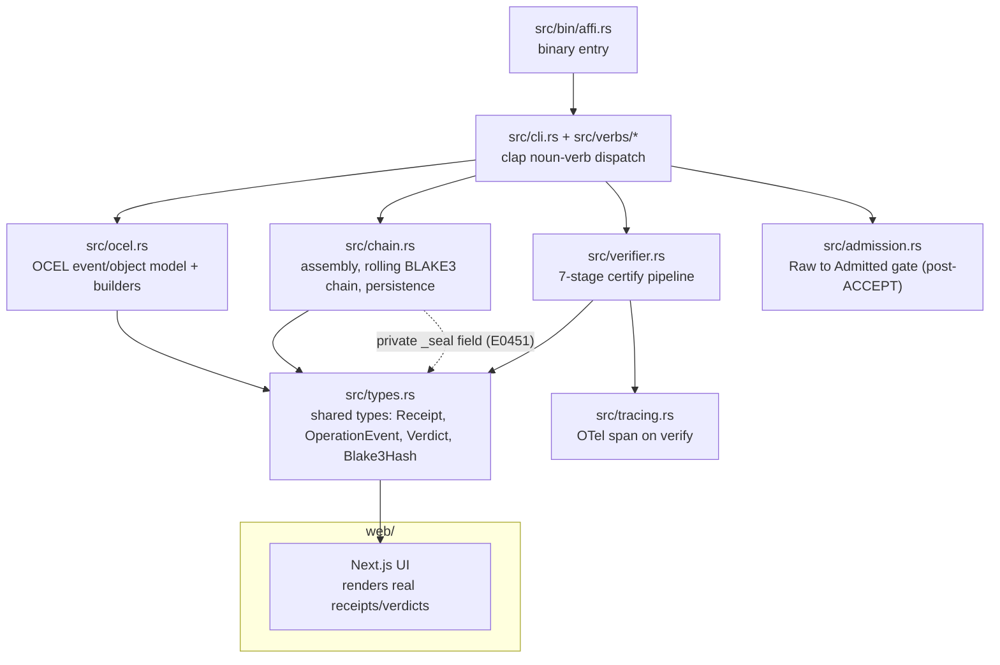

# Architecture overview

`affidavit` is **the provenance layer**. It assembles and certifies *provenance
receipts*: append-only, content-addressed [BLAKE3](https://github.com/BLAKE3-team/BLAKE3)
chains of operation-events that record what a process did. The `affi` binary
emits events, finalizes them into an immutable receipt, and certifies that
receipt against a fixed format standard.

Three ideas hold the whole design together (the doctrine — see
[`../README.md`](../README.md) and [`../ARDPRD.md`](archive/ARDPRD.md)):

- **Certify, don't decide.** The verifier never judges whether work was honest
  (an undecidable question). It checks a *witness* — the receipt — against a
  format standard, and every check is decidable.
- **The bypass is unconstructable.** A `Receipt` cannot be built by struct
  literal: a private `_seal` field makes that a compile error (`E0451`). Only the
  canonical seam (`chain::ChainAssembler::finalize`) can mint a sealed receipt.
- **Deserialization re-verifies the chain.** Loading a receipt from disk
  recomputes its rolling chain hash, so a forged or tampered file is rejected at
  the boundary, not trusted.

For precise definitions of every term below, see the
[glossary](glossary.md).

---

## 1. Receipt lifecycle: emit → assemble → verify / show

The CLI is a noun-verb surface (`affi receipt <verb>`). The lifecycle moves a
set of events from a mutable working file into a sealed, content-addressed
receipt, then certifies it.

```mermaid
flowchart TD
    U([User / process]) --> E["affi receipt emit<br/>--type T --object id:type[:qualifier] --payload F"]
    E -->|"append event, commitment = blake3(payload)"| W[(".affi/working.json<br/>append-only events")]
    W --> A["affi receipt assemble"]
    A -->|"fold rolling BLAKE3 chain, seal via ChainAssembler::finalize"| R[("receipt.json<br/>sealed + content-addressed")]
    R --> V["affi receipt verify"]
    R --> S["affi receipt show"]
    V --> P{{"7-stage certify pipeline"}}
    P -->|all stages pass| ACC["ACCEPT (exit 0)"]
    P -->|first stage fails| REJ["REJECT (exit != 0)"]
    S --> H["human-readable chain dump<br/>(no verdict)"]
```

| Verb | What it does |
| --- | --- |
| `affi receipt emit --type <event_type> --object <id:type[:qualifier]> ... --payload <file\|->` | Appends one operation-event to the working receipt (`.affi/working.json`). The stored commitment is `blake3(payload)`; the raw payload is never persisted. |
| `affi receipt assemble [--out <path>]` | Finalizes the working events into an immutable receipt, folding the rolling BLAKE3 chain and **sealing** the result. The default filename is the content address (BLAKE3 of canonical bytes). |
| `affi receipt verify <receipt.json>` | Runs the 7-stage certify pipeline. Prints per-stage outcomes and a final verdict; exits `0` on ACCEPT, non-zero on REJECT. |
| `affi receipt show <receipt.json>` | Human-readable dump of the chain. This is the *non-adjudicating* half of the pair — it never renders a verdict. |

`verify` and `show` are deliberately a **type-blind pair**: they take the same
input and only convention (witnessed behaviorally) keeps them on distinct
handlers. `show` returns a plain `Receipt`; only the admission path mints an
admitted one.

See the runnable end-to-end smoke at
[`../examples/golden_run.sh`](../examples/golden_run.sh) (ACCEPT, then a `sed`
tamper that flips the verdict to REJECT).

---

## 2. The 7-stage certify pipeline

`verify` is a straight pipeline — no component decides honesty. It is pure over
the receipt bytes: the same receipt always yields the same `Verdict`, and it
reads commitments, never raw payloads. The verdict is ACCEPT iff every stage
passes; otherwise it is REJECT carrying the first failing stage and its reason.

```mermaid
flowchart LR
    IN([receipt bytes]) --> S1
    subgraph PIPE["verifier.rs :: verify - pure over receipt bytes"]
        direction LR
        S1["1. decode<br/>structure + version parse"] --> S2["2. check_format<br/>format_version == core/v1"]
        S2 --> S3["3. chain_integrity<br/>recompute rolling BLAKE3 == stored chain_hash"]
        S3 --> S4["4. continuity<br/>seq contiguous from 0, unique ids"]
        S4 --> S5["5. verify_commitments<br/>each commitment well-formed BLAKE3"]
        S5 --> S6["6. evaluate_profile<br/>core/v1: event_type + commitment present"]
        S6 --> S7["7. emit_verdict"]
    end
    S7 -->|every stage passed| ACC["Verdict::ACCEPT"]
    S7 -->|first failing stage + reason| REJ["Verdict::REJECT"]
```

| # | Stage | Decidable check |
| --- | --- | --- |
| 1 | `decode` | Receipt is structurally present and the version field parses. |
| 2 | `check_format` | `format_version` equals the standard this verifier knows (`core/v1`). |
| 3 | `chain_integrity` | Recompute the rolling BLAKE3 chain hash from event bytes and compare to the stored `chain_hash`. |
| 4 | `continuity` | `seq` is contiguous from 0 with no gaps; event ids are unique. |
| 5 | `verify_commitments` | Every payload commitment is a well-formed BLAKE3 digest (commitments only — never raw payloads). |
| 6 | `evaluate_profile` | Profile `core/v1`: each event carries an `event_type` and a commitment. |
| 7 | `emit_verdict` | ACCEPT iff every prior stage passed; otherwise REJECT with the first failing stage's reason. |

Because each chain link folds the previous chain hash with the canonical bytes
of the next event, editing any single event re-routes every later link — so
`chain_integrity` recomputes a hash that no longer matches the stored one, and
the verdict flips to REJECT.

---

## 3. Module map

The source tree maps cleanly onto the lifecycle and the pipeline. `src/types.rs`
holds the shared types (including the sealed `Receipt` with its private `_seal`);
everything else builds on it.

```mermaid
flowchart TD
    BIN["src/bin/affi.rs<br/>binary entry"] --> CLI["src/cli.rs + src/verbs/*<br/>clap noun-verb dispatch"]
    CLI --> OCEL["src/ocel.rs<br/>OCEL event/object model + builders"]
    CLI --> CHAIN["src/chain.rs<br/>assembly, rolling BLAKE3 chain, persistence"]
    CLI --> VER["src/verifier.rs<br/>7-stage certify pipeline"]
    OCEL --> TYPES["src/types.rs<br/>shared types: Receipt, OperationEvent, Verdict, Blake3Hash"]
    CHAIN --> TYPES
    VER --> TYPES
    CHAIN -. "private _seal field (E0451)" .-> TYPES
    VER --> TRACE["src/tracing.rs<br/>OTel span on verify"]
    CLI --> ADM["src/admission.rs<br/>Raw to Admitted gate (post-ACCEPT)"]
    subgraph WEB["web/"]
        UI["Next.js UI<br/>renders real receipts/verdicts"]
    end
    TYPES --> UI
```

| Path | Responsibility |
| --- | --- |
| `src/bin/affi.rs` | Binary entry point. |
| `src/cli.rs` + `src/verbs/*` | clap noun-verb parsing and 65+ command implementations across 9 verb families: core provenance, emit variants, assemble variants, verify variants, SBOM, quality/monitoring, audit/compliance, analysis, and developer tools. |
| `src/ocel.rs` | OCEL event/object/relationship model and builders (`object_ref`, `parse_object_ref`, `build_event`). |
| `src/chain.rs` | Receipt assembly: the rolling BLAKE3 chain hash (seeded by `GENESIS_SEED`), serialize/deserialize, persistence, and the sealing seam `ChainAssembler::finalize`. |
| `src/verifier.rs` | The 7-stage certify pipeline. |
| `src/types.rs` | Shared types: `OperationEvent`, `Receipt` (private `_seal`), `Verdict`, `CheckOutcome`, `ProfileId`, `Blake3Hash`. |
| `src/admission.rs` | The `Raw → Admitted` gate; mints `Admitted` only after the certify pipeline returns ACCEPT. |
| `src/quality.rs` + `src/quality_*.rs` | Western Electric statistical process control (SPC) monitoring; real-time anomaly detection and trend analysis. |
| `src/sbom.rs` + `src/sbom_*.rs` | Software Bill of Materials (SBOM) generation, parsing, NTIA compliance checking, and vulnerability aggregation. |
| `src/tracing.rs` | OpenTelemetry span emission wrapping `verify`. |
| `src/lib.rs` | Module declarations and re-exports. |
| `web/` | Next.js UI that renders real receipts, verdicts, and benchmarks (see [`../REPRESENTATION_MAP.md`](../REPRESENTATION_MAP.md)). |
| `src/crypto_trust_canonical.rs` | JCS (RFC 8785) canonical JSON and domain-separated BLAKE3 digests — the byte law every signature is computed over. |
| `src/crypto_trust_keys.rs` | Algorithm ids, crypto profiles, `KeyId`/`KeyRecord`/fingerprints, custody identity and origin, in-memory key registry. |
| `src/crypto_trust_lifecycle.rs` | Key epochs, rotation policy (default: 2 epochs in flight, 90-day max age), revocation list doubling as the revocation-epoch clock. |
| `src/crypto_trust_envelope.rs` | The 12-field signed envelope (`CTP-ENVELOPE-v1`) and the nonce journal backing replay rejection. |
| `src/crypto_trust_es256.rs` | ES256 signing and verification (P-256, SHA-256, RFC 6979 deterministic). |
| `src/crypto_trust_pqc.rs` | ML-DSA-65 (FIPS 204), SLH-DSA-SHA2-128s (FIPS 205), and the hybrid ES256+ML-DSA-65 signature. |
| `src/crypto_trust_verify.rs` | The ordered verification law — bytes → window → policy → registry → revocation → replay → signature; mints a `CryptoStandingReceipt` on `VALID` only. |
| `src/crypto_trust_seal.rs` | `SealedReceipt` (`PQ-SEAL-v1`): envelope + signature bound to a receipt's content address. |
| `src/crypto_trust_store.rs` | Durable, tamper-evident public-key store. |
| `src/crypto_trust_sa2a.rs` | SA2A wire interop (RFC-SA2A-007-errata): a `SignatureEnvelope` + signature is an SA2A approval, and vice versa. |
| `src/crypto_trust_journal.rs` | Append-only, hash-chained journal of cryptographic standing receipts. |
| `src/crypto_trust_transparency.rs` | RFC 9162-style append-only Merkle transparency log over envelope commitments (BLAKE3 in place of SHA-256). |
| `src/crypto_trust_rotation.rs` | Key rotation ceremony and the classical → hybrid → PQC profile migration law. |
| `src/crypto_trust_quorum.rs` | k-of-n signature quorum over one envelope signing pre-image, shares under distinct registered keys. |
| `src/crypto_trust_revocation.rs` | Signed revocation publication (`CTP-CRL-v1`). |
| `src/crypto_trust_log.rs` | Operational surface binding the standing journal and the Merkle log. |
| `src/crypto_trust_kat.rs` | Known-answer-test vectors produced by real signatures, for cross-runtime verification. |
| `src/crypto_trust_doctor.rs` | `affi doctor` crypto-health checks registered into the shared `DoctorCheck` registry. |
| `src/crypto_trust_enclave.rs` | Signing-provider dispatch: SOFTWARE / SECURE_ENCLAVE (macOS Security.framework); HSM is a typed `UNSUPPORTED`, never faked. |
| `tests/crypto_trust_e2e.rs` | End-to-end court: ontology → keys → envelope → sign → verify → standing → seal → tamper → refuse. |
| `benches/crypto_trust_bench.rs` | Criterion benches over sign, verify, JCS, and the envelope signing pre-image. |

> Note: the `crypto_trust_*` modules are **pack-rendered**. `ggen sync`
> projects them from the `affidavit-trust-plane-pack` ontology
> (`../ggen-marketplace/packs/affidavit-trust-plane-pack`, wired in
> `ggen.toml`); the ontology is the source of truth and the rendered files are
> never hand-edited. All are compiled only under the `crypto-trust` feature
> (`crypto_trust_enclave` additionally under `secure-enclave`). The as-built
> capability map and the honest standing table live in
> [`CRYPTO_TRUST_PLANE.md`](CRYPTO_TRUST_PLANE.md).

> Note: this map reflects the tree as of v26.6.22, which expanded
> the core with quality (Western Electric), SBOM, and OCEL verticals, and was
> extended in v26.9.28 by the cryptographic trust plane above.
> Additional modules (`src/handlers.rs`, `src/discovery.rs`,
> `src/lsp.rs`) support broader integration work; see
> [`../STATUS.md`](../STATUS.md) for the implementation roadmap.

---

## Determinism guarantees

- **No wall-clock.** Events are ordered by a monotonic `seq` counter, not
  timestamps — same inputs, same receipt, same verdict.
- **No RNG, no map-iteration order.** Serialized output is canonical/sorted
  JSON, so hashing reproduces across runs and machines.
- **The verifier is pure over the receipt bytes** and reads commitments, never
  raw payloads.

---

## Where to go next

- The doctrine and full requirements: [`../ARDPRD.md`](archive/ARDPRD.md).
- Current build/test/integration status: [`../STATUS.md`](../STATUS.md).
- Precise term definitions: [glossary](glossary.md).
- Everything else, categorized: the [documentation hub](README.md).
