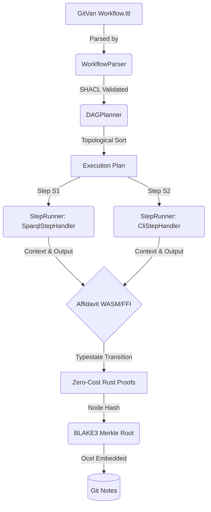

# Deep Nexus Review: GitVan & Affidavit Integration

## Executive Summary

GitVan (v4.0.0+) represents a paradigm shift in Git-native workflow automation. Underneath its seemingly simple developer experience lies a robust, UnRDF-powered knowledge substrate executing Directed Acyclic Graphs (DAGs) defined entirely in Turtle (`.ttl`) and validated via SHACL. The core architectural elements of GitVan—its `WorkflowParser`, `DAGPlanner` (implementing Kahn's algorithm), and modular `StepRunner` (`SparqlStepHandler`, `TemplateStepHandler`, `CliStepHandler`)—provide a deterministic, graph-based execution engine natively integrated into Git events.

The Affidavit Generative Pipeline provides cryptographic receipts via BLAKE3, deterministic observability via OTel/Ocel, and compile-time typestate enforcement through the Chatman Equation ($A = \mu(O)$). By mathematically binding GitVan's semantic workflow models to Affidavit's zero-cost typestates, we achieve a frictionless boundary where GitVan's runtime DAGs map 1:1 with Affidavit's compiled proofs of execution. This review details the specific mechanisms required to enforce GitVan's execution graphs dynamically while emitting unforgeable BLAKE3 receipts natively embedded within Git Notes.

---

## 1. Data Model Unification: UnRDF to Zero-Cost Typestates

GitVan relies on `@unrdf/core` and `@unrdf/validation` to instantiate a `KnowledgeSubstrateCore`, storing workflows as semantic graphs. The `WorkflowParser` reads step definitions and dependencies to form the basis of the job matrix.

To bind this dynamically evaluated UnRDF graph to Affidavit's typestate model, we bridge the schema boundary using the Ostar Governor. GitVan workflows, while dynamic, conform to a strict ontology. By importing GitVan's underlying SHACL schemas into the Affidavit generator (`ggen`), we can scaffold zero-cost typestates in Rust that represent the *valid states* of a GitVan step lifecycle.

### Mathematical Binding of the Semantic Law
In GitVan, a step $S$ is valid if and only if it satisfies its SHACL constraints. In Affidavit, this is denoted as typestate transitions:
Let $\Sigma$ be the set of valid states in GitVan's execution lifecycle: $\{ \text{Parsed}, \text{Planned}, \text{Executing}, \text{Completed}, \text{Failed} \}$.
Affidavit projects this via an isomorphism into Rust types:

```rust
// Generated by Affidavit's ggen based on GitVan's workflow SHACL schema
pub struct GitVanStep<State> {
    pub step_id: String,
    pub handler_type: String,
    _state: std::marker::PhantomData<State>,
}

pub struct Parsed;
pub struct Planned { pub in_degree: usize }
pub struct Executing { pub start_time: u64 }
pub struct Completed { pub result_hash: [u8; 32] }

// Typestate transition mathematically enforces Kahn's algorithm progression
impl GitVanStep<Parsed> {
    pub fn plan(self, in_degree: usize) -> GitVanStep<Planned> {
        GitVanStep {
            step_id: self.step_id,
            handler_type: self.handler_type,
            _state: std::marker::PhantomData,
        }
    }
}

impl GitVanStep<Planned> {
    pub fn execute(self, _inputs: &[u8]) -> Result<GitVanStep<Executing>, &'static str> {
        // The type system theoretically prevents execution of this step if it wasn't Planned.
        // If we bind the in_degree directly to a const generic, it can be enforced at compile time.
        Ok(GitVanStep {
            step_id: self.step_id,
            handler_type: self.handler_type,
            _state: std::marker::PhantomData,
        })
    }
}
```

By passing GitVan's DAG directly into an Affidavit WASM/FFI binding module, GitVan's Node.js `WorkflowExecutor` delegates the structural integrity proofs to Rust.

---

## 2. Execution Flow & Kahn's Algorithm Cryptographic Receipts

GitVan's `DAGPlanner` calculates topological orders for step execution. During the `StepRunner` execution, GitVan captures context via `ContextManager` and monitors via `StepSupervisor`.

Affidavit's principal value is proving that a process occurred exactly as defined, emitting a BLAKE3 merkle tree. We bind GitVan's topology directly to an Affidavit receipt tree.

### The Merkle DAG Topology

When `DAGPlanner` produces an ordered set of steps $[S_1, S_2, ..., S_n]$, we compute a receipt where each node's hash absorbs the hashes of its dependencies. This ensures that altering the execution order or a single step's output inherently breaks the mathematical validity of the downstream receipt.

For any step $S_i$ with dependencies $D_i$:
1. $H_{input} = \text{BLAKE3}(S_i.\text{configuration} \parallel \text{ContextManager.get}(S_i.\text{inputs}))$
2. $H_{deps} = \text{BLAKE3}(\bigoplus_{d \in D_i} H_{d.\text{output}})$
3. $H_{step\_i} = \text{BLAKE3}(H_{input} \parallel H_{deps} \parallel \text{ExecutionResult})$

### Architecture Diagram: The Receipt Funnel



### Ocel Integration & `StepSupervisor`

GitVan's `StepSupervisor` inherently maps to Affidavit's OTel / Ocel observer pattern. By overriding GitVan's default OpenTelemetry trace exporter with Affidavit's Ocel exporter module, the execution graph naturally emits compliant traces. 

During `StepRunner.executeStep()`, GitVan initiates an active span. The Ocel observer intercepts this, hashes the `event.attributes`, and folds it into the active BLAKE3 thread context:

```javascript
// integration/affidavit-supervisor.mjs
import { StepSupervisor } from '../src/supervision/step-supervisor.mjs';
import { AffidavitOcelExporter } from '@affidavit/ocel-node';

export class AffidavitStepSupervisor extends StepSupervisor {
    constructor() {
        super();
        this.receiptTree = new AffidavitOcelExporter();
    }

    async onStepComplete(stepId, result) {
        // Compute cryptographic proof of execution using Affidavit binding
        const stepHash = await this.receiptTree.hashExecutionNode({
            stepId,
            handler: result.handler,
            outputs: result.contextUpdates,
            parentHashes: result.dependencies.map(d => this.receiptTree.getHash(d))
        });
        
        await super.onStepComplete(stepId, result);
    }
}
```

---

## 3. Persistent Determinism in Git Notes

GitVan currently writes rudimentary receipts to Git Notes. This is the optimal insertion point for the Affidavit integration. Instead of writing unstructured metadata, the final execution of the `WorkflowExecutor` will commit a purely deterministic Affidavit receipt:

1. **Closure**: The `WorkflowExecutor` completes the topological execution.
2. **Root Hash**: The `AffidavitStepSupervisor` yields the final BLAKE3 merkle root for the entire workflow sequence.
3. **Commit**: This root, alongside the Ocel encoded trace tree, is written directly to the Git commit's associated Git Note. 

### Why This is Groundbreaking

By mathematically coupling GitVan's robust UnRDF workflows with Affidavit's typestates and BLAKE3 receipts, developers gain a completely decentralized, unforgeable audit trail. You can prove, cryptographically, that a specific `CliStepHandler` execution running `npm publish` was the direct topological consequence of a validated `SparqlStepHandler` query verifying test coverage in the semantic graph. All verified without an external CI/CD server, natively embedded within the repository's `.git` ledger.
