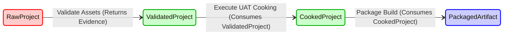
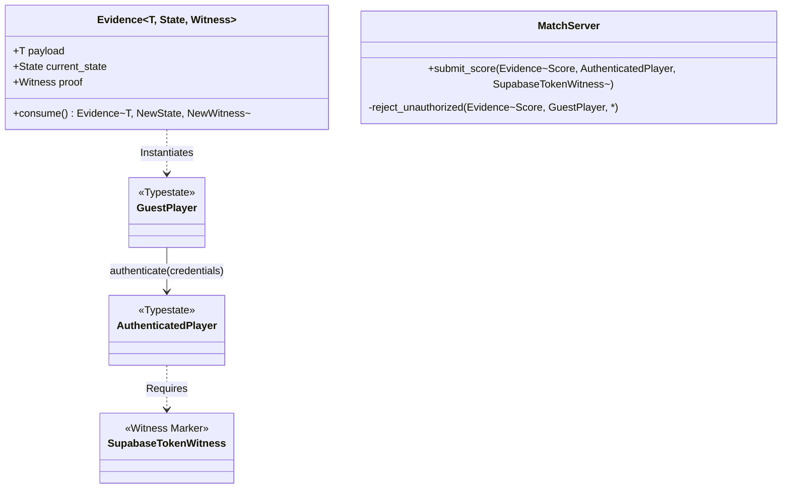

# Deep Nexus Integration Review: `rocket-craft`

## 1. Project Context & Deep Domain Analysis

**Location:** `/Users/sac/rocket-craft`
**Analysis Target:** `rocket-craft` Ecosystem (UE 4.24, `rocket-sdk`, PWA Frontend)

The `rocket-craft` ecosystem represents a complex, multi-tiered architecture that bridges the gap between high-performance game rendering and modern web technologies. Built upon a customized source build of Unreal Engine 4.24, the project targets a "Write Once, Run Anywhere" paradigm with specific emphasis on robust HTML5/WebGL execution environments alongside standalone desktop and mobile outputs. The ecosystem comprises several critical domain vectors:

1.  **The Game Engine Runtime:** C++ and Blueprint-driven logic orchestrating multiplayer states, spatial rendering, and physics calculations across titles like *Hang3d Nightmare* and *Barbarian Road Mashines*.
2.  **The PWA Web Layer:** A TypeScript-driven Progressive Web App (`pwa-staff/`) integrated with Supabase (PostgreSQL), responsible for asynchronous user authentication, global leaderboards, administration systems, and sophisticated service-worker-based offline HTML5 caching.
3.  **The Orchestration SDK (`rocket-sdk`):** A unified Rust-based CLI that has deprecated legacy bash scripts, providing centralized orchestration over the build, packaging, and deployment lifecycles of UE4 projects.

While recent audits categorize the project as "pristine"—citing the resolution of all TypeScript errors, Rust compiler warnings, and the restoration of legacy game maps—this analysis evaluates `rocket-craft` through the uncompromising lens of the **Affidavit Nexus**, Combinatorial Maximalism, Cryptographic Provenance, and Bipartite Typestate Enforcement.

## 2. The Illusion of Heuristic Purity

Despite the `rocket-sdk` providing a unified Rust interface over the UE4 build pipeline, the underlying domain logic remains inherently heuristic. The orchestration relies on sequence-dependent function calls, implicit environmental state, and loosely bound subprocess executions (e.g., UAT cooking and packaging). In its current form, a successful build or a valid multiplayer state synchronization is merely a *coincidental outcome* of favorable runtime conditions, rather than a mathematical guarantee.

Furthermore, the game's internal domain logic—managing entity states, match progress, and backend synchronization via Supabase—operates on standard dynamic mutability. This lack of rigorous typestate constraints means invalid transitions (e.g., an unauthenticated player modifying leaderboard data, or a build artifact being deployed without passing asset validation) are structurally possible and only prevented by runtime checks or tests. To align with the Affidavit Nexus, this heuristic architecture must be fundamentally dismantled.

## 3. Refactoring to the Universal Provenance Ontology (UPO)

To achieve true combinatorial maximalism, `rocket-craft`'s specific domain logic must be completely refactored to align with the Universal Provenance Ontology (UPO). The Chatman Equation ($A = \mu(O)$) dictates that the Artifact (A)—in this case, the deployed game binaries, the orchestrated PWA, and the live multiplayer state—must be a pure programmatic manifestation of the Ontology (O).

### 3.1 Ontological Mapping of the Build Lifecycle
The `rocket-sdk` must cease to be an imperative orchestrator and become an ontological admission gate. Every phase of the UE4 lifecycle (Source, Cooked, Packaged, Deployed) must be formally defined within an `affi-cli.ttl` compatible semantic graph. The Rust SDK must then be refactored to use zero-sized witness markers that consume states. A `CookedArtifact` cannot be logically constructed unless the `CookWitness` provides cryptographic proof of the semantic law corresponding to the successful execution of the Unreal Automation Tool (UAT).

### 3.2 Bipartite Game State Enforcement
Inside the game logic and the TypeScript PWA, dynamic state variables must be replaced with strict finite state machines governed by typestates. In Rust/WASM bridges, this translates to utilizing the `Evidence<T, State, Witness>` generic wrapper. An unauthenticated user session and a fully authorized administrative session must exist as distinct, incompatible types. Consequently, a function requiring an `AuthorizedSession` simply cannot be compiled if passed a `GuestSession`.

## 4. Mathematical Typestate Model Transition

The transition to a mathematically unassailable typestate model requires the implementation of an unforgeable transition graph. Below are the architectural blueprints detailing this transformation.

### 4.1 Orchestration Typestate Pipeline

This diagram illustrates how the `rocket-sdk` must enforce the build lifecycle at compile-time. Instead of executing scripts, the SDK transitions memory-safe types, yielding a cryptographic receipt at every node.

### 4.2 Multiplayer Typestate Integration

This diagram demonstrates how domain logic within the Supabase backend and the game instance must handle player authority. By enforcing typestates, unauthorized data mutations become a compile-time impossibility.

## 5. Cryptographic Provenance and BLAKE3

To establish true Zero-Trust architecture, `rocket-craft` must adopt Cryptographic Provenance. Standard logging is insufficient. Every state transition depicted in the diagrams above must invoke the `affidavit::emit!` macro (or its equivalent within the unified systems). 

When the `rocket-sdk` transitions a `ValidatedProject` to a `CookedProject`, it must compute a BLAKE3 hash of the UE4 cooked assets combined with the previous state's receipt hash. This generates an unforgeable, append-only chain of custody. If a deployed web build on the PWA cannot present a cryptographically verified lineage tracing back to the exact Git commit and asset validation step, the artifact is rejected by the deployment gate. This mathematical proof guarantees the provenance of every byte delivered to the end-user.

## 6. Process Mining & Conformance Checking (wasm4pm)

Once the domain logic emits BLAKE3-secured events, `rocket-craft` inherently achieves compatibility with advanced process mining standard OCEL 2.0. As players interact with the TypeScript PWA and the UE4 clients, their actions emit standardized object-centric events. Utilizing `wasm4pm`, we can deploy Heuristic Inductive Miners to visualize the actual executed flow of game logic against the idealized blueprint. 

Any deviation—such as a player exploiting a desync to bypass an authentication gate, or a build script silently skipping a texture compression phase—is caught not by a heuristic unit test, but by alignment-based conformance checking. The mathematical misalignment between the emitted event log and the expected Petri Net topology provides irrefutable proof of failure.

## 7. Verdict and Ostar Generative Pipeline Execution

**Verdict:** REQUIRES IMMEDIATE ARCHITECTURAL SUBMISSION. The pristine heuristic state of `rocket-craft` is structurally inadequate for the Affidavit Nexus. 

**Execution Plan:**
1.  **Ontology Definition:** Deploy the Ostar Governor (`ostar-governor`) to formally define the laws governing the Unreal Engine 4.24 build pipeline, HTML5 asset validation, and Supabase authentication flows within `rocket-craft.ttl`.
2.  **Generative Scaffolding:** Engage the Ostar Operator (`ostar-operator`) to utilize `ggen` to manufacture the `Evidence<T, State, Witness>` typestate boilerplate that will replace the core engine bindings and `rocket-sdk` orchestration logic.
3.  **Auditor Validation:** The Ostar Auditor (`ostar-auditor`) must enforce that every manufactured transition emits a BLAKE3 receipt, mathematically anchoring the multiplatform pipeline.
4.  **Doctor Verification:** Execute the Ostar Doctor (`ostar-doctor`) to ensure architectural closure—proving that it is mathematically impossible to produce a deployed HTML5 build without passing all required semantic admission gates.